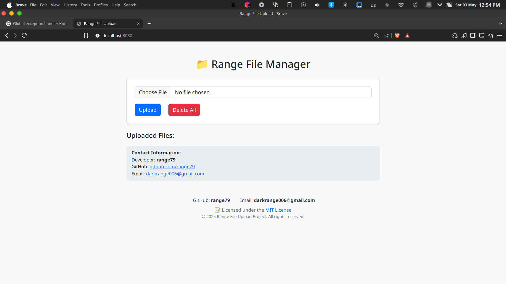

# 📁 Kotlin File Upload Server (Cross-Platform & Android Compatible)

A lightweight, portable **file upload server** built with **Kotlin + Spring Boot**.  
Runs smoothly on **Windows**, **macOS**, **Linux**, and even **Android** (via Termux).

Easily upload, download, and manage files from a responsive web UI — without needing any database installation or external dependencies.

---

## 🚀 Features

- 📤 Upload files via UI
- 📥 Download files by ID
- 🗑️ Delete individual or all files
- 🌐 Modern, responsive web interface (Thymeleaf)
- 💾 Embedded H2 DB — zero configuration
- 📱 Works even on Android via Termux
- 🖥️ One-click `windows.bat` support
- 🍏 macOS users can also use `android.sh` with Java installed
- ✅ `.jar` is **committed** (not in `.gitignore`) — no build required!

---

## ⚙️ Tech Stack

- Kotlin (JVM 17)
- Spring Boot 3.4.5
- H2 Database
- Spring Web + JPA
- Thymeleaf
- JUnit 5 + KotlinTest
- SLF4J Logging

---

## 📸 Screenshot



---

## 🧱 Project Structure


.
├── android.sh           # Android/macOS/Unix launcher
├── windows.bat          # One-click Windows launcher
├── build/libs/          # Contains the compiled .jar
├── src/                 # Source code
├── images/              # Screenshots
└── README.md

````

---

## 📱 Run on Android, Linux, macOS

> ✅ **Run `android.sh`** – works on Android (Termux), Linux, and macOS.

### ☑️ Prerequisites

- `Java 17+` must be installed on your system
  - On Android: script installs OpenJDK
  - On macOS: use `brew install openjdk@17`
  - On Linux: use `apt install openjdk-17-jdk`

### 🔧 Steps:

```bash
git clone https://github.com/range79/file-server.git
cd file-server
chmod +x android.sh
./android.sh
````

Then open your browser:

```
http://localhost:8080
```

---

## 🪟 Run on Windows


> Just double-click `windows.bat`
> Or run it from terminal:

```cmd
windows.bat
```

> ⚠️ **Note:** This script hasn’t been fully tested yet.
> If you encounter issues and have experience with Windows Batch scripting, feel free to fork the project and help improve it!


Make sure Java 17+ is installed and added to your `PATH`.

---

## 🧪 Run Tests

```bash
./gradlew test
```

---

## 🧰 Build Manually

```bash
./gradlew build
```

Your final `.jar` will be here:

```
build/libs/FIle-Upload-1.0.0-STABLE.jar
```

---

## 📜 License

MIT — use freely, improve openly.

---

## 🙋‍♂️ Author

Developed with ❤️ by **range79**

* 💻 GitHub: [github.com/range79](https://github.com/range79)
* 📧 Email: [darkrange6@gmail.com](mailto:darkrange6@gmail.com)

